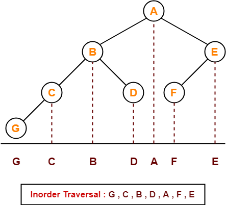
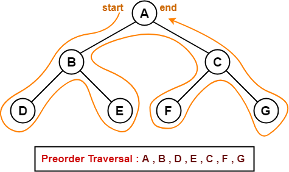
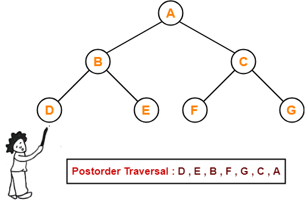

# Binary Trees

Constructor chaining -> Calling one constructor from another constructor  

## Tree Creation

### Java

```java
public static class Node {
    int data;  
    Node left = null;
    Node right = null;

    Node() {
        data = -1;
        left = null;
        right = null;
    }

    Node(int data, Node left, Node right) {  
        this.data = data;
        this.left = left;
        this.right = right;
    }
}  
```

### CPP

-> = (.)*

this -> data = (this.data)*

```CPP
class Node {
    int data;  
    Node left;
    Node right;

    public:

    Node() {
        this -> data = INT_MIN;
        this -> left = NULL;
        this -> right = NULL; // this -> right = nullptr;
    }

    Node(int data, Node *left, Node *right) {  
        this -> data = data;
        this -> left = left;
        this -> right = right;
    }
}  
```

## Tree Traversal

### Inorder



### Preorder



### Postorder



### Levelorder

#### Using single queue and null

[10 null]

[null {Children of 10} ]

[20 30 null]

[30 null {Children of 20}]

#### Using single queue and checking size

```java
public static void levelOrder(Node node) {
    LinkedList queue = new LinkedList();
    queue.addLast(node.data);
    while(queue.size() != 0) {

    }
}
```
